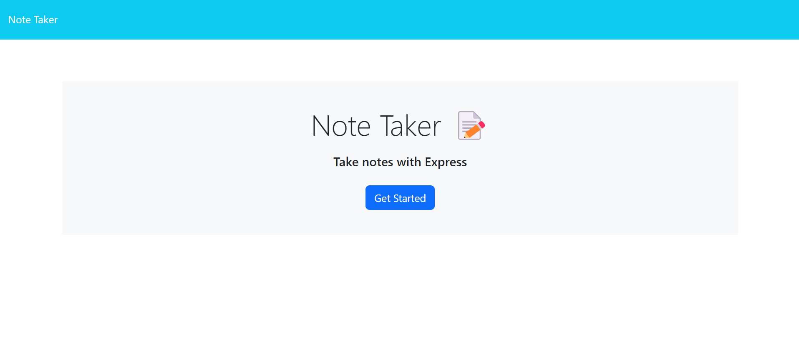
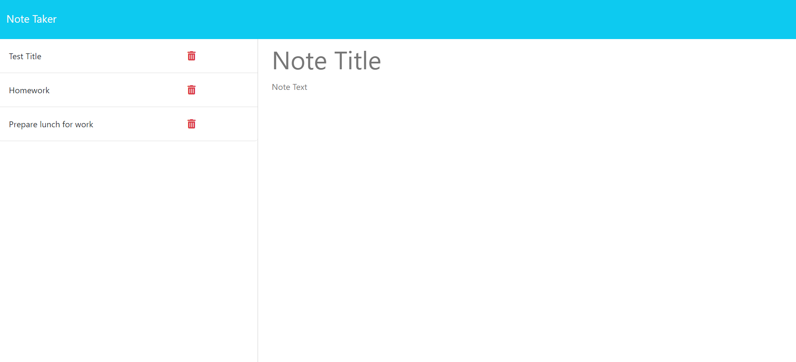
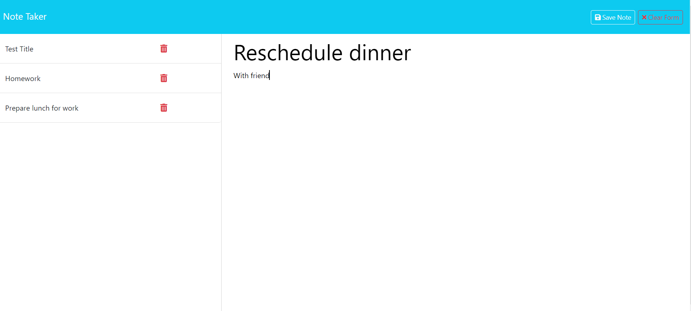
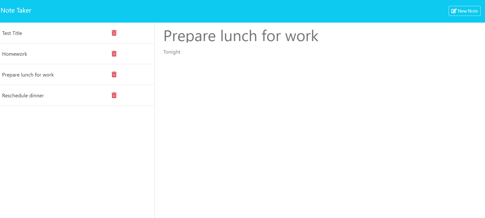

# Express.js Note Taker


## Description ***


## Table of Contents
- [Express.js Note Taker](#expressjs-note-taker)
  - [Description \*\*\*](#description-)
  - [Table of Contents](#table-of-contents)
  - [User Stor](#user-stor)
  - [Acceptance Criteria](#acceptance-criteria)
  - [Technologies Used](#technologies-used)
  - [Features](#features)
  - [Installation](#installation)
  - [Usage](#usage)
    - [Screenshots: \*\*\*](#screenshots-)
  - [Tests](#tests)
  - [Links \*\*\*](#links-)
  - [Credits](#credits)
  - [License](#license)
  - [Questions](#questions)


## User Stor
```md
AS A small business owner
I WANT to be able to write and save notes
SO THAT I can organize my thoughts and keep track of tasks I need to complete
```

## Acceptance Criteria
```md
GIVEN a note-taking application
WHEN I open the Note Taker
THEN I am presented with a landing page with a link to a notes page
WHEN I click on the link to the notes page
THEN I am presented with a page with existing notes listed in the left-hand column, plus empty fields to enter a new note title and the note’s text in the right-hand column
WHEN I enter a new note title and the note’s text
THEN a "Save Note" button and a "Clear Form" button appear in the navigation at the top of the page
WHEN I click on the Save button
THEN the new note I have entered is saved and appears in the left-hand column with the other existing notes and the buttons in the navigation disappear
WHEN I click on an existing note in the list in the left-hand column
THEN that note appears in the right-hand column and a "New Note" button appears in the navigation
WHEN I click on the "New Note" button in the navigation at the top of the page
THEN I am presented with empty fields to enter a new note title and the note’s text in the right-hand column and the button disappears
```

## Technologies Used
- HTML
-	CSS
-	JavaScript
-	Node.js
-	Express.js 
-	NPM
-	JSON for data storage and retrieval 
-	Render to host the application

## Features
* **Create and Save Notes:** Easily create new notes by entering a title and text content and then saving them.
* **View Existing Notes:** View a list of all saved existing notes with their titles and contents.
* **Delete Existing Notes:** Delete notes that are no longer needed to keep the list organized.
* **Front End/Back End Connection:** Application front end connects to an Express.js back end.
* **Persistent Storage:** Notes are stored in a JSON file on the server with unique IDs, ensuring data persistence across sessions.
* **Render Deployment:** Application is deployed to Render for easy access.

## Installation
To install the Express.js Note Taker, follow the following steps:
1.	Clone the repository to your local machine: `git clone https://github.com/vaughanknouse/express-note-taker.git`.
2.	Ensure that the current version of Node.js is installed. 
3.	Open the cloned repository in a CLI, such as Visual Studio (VS) Code.
4.	Navigate to the project directory in your terminal.
5.	Initialize a project with `package.json` by typing `npm init -y` in the terminal where project files will be stored.
6.	Install the dependency packages associated with this application by typing `npm i` in the command line to ensure that the `node-modules` folder is operating on your local device. 
7. If needed. install Express manually so it can be used within the node terminal by typing `npm i express` in the terminal.
8. To run the server, within the terminal, type the command `npm start` or `node server.js`.


## Usage
To use the Express.js Note Taker, follow the following steps:
1. **Open the Application:** Once your local server is running, the front end of the application can be accessed either directly from the command line by navigating to the link http://localhost:3001 or by clicking the deployed link hosted on Render seen in the "Links" section.
2. **Landing Page/Navigate to Notes Page:** When the application opens, click "Get Started" on the landing page to open the Note Taker on the notes page.
3. **Existing Notes:** On the notes page, you will see a list of existing notes displayed in the left-hand column.
4. **Create a New Note:** To create a new note, fil in the empty fields in the right-hand column. Enter a title for your note in the  "Note Title" field and the content of your note in the "Note Text" field.
   - Once you enter a new note's title and text, a "Save Note" button and a "Clear Form" button will appear in the navigation at the top right of the page.
5. **Save Note/Clear Form:** To save your newly created note, click on the "Save Note" button. Your new note will then be added to the list of existing notes, which is seen in the left-hand column of the page. Alternatively, to clear the note, click the "Clear Form" button in the navigation at the top right of the page to clear the note contents. 
   - The "Save Note" and "Clear Form" buttons in the navigation will disappear once the new note is saved.
6. **View Existing Note Details:** To view the details of a saved existing note, click on the note's title from the list in the left-hand side of the page. The saved note's contents will then appear in the right-hand column of the page.
   - A "New Note" button will appear in the navigation at the top right of the page. 
7. **Create Another New Note:** To create another new note, click on the "New Note" button in the navigation at the top of the page. This will clear the fields in the right-hand column, allowing you to enter a new title and text for your note.
     - The "New Note" button will then disappear once this new additional note is created.
8. **Bonus Feature - Deleting a Note**: You can delete a saved note by clicking on the trash can icon associated with the specific note that you want to remove.
   

### Screenshots: ***
The following screenshots demonstrate the application's functionality and appearance:

Landing page with link to Notes page:


Notes page with existing notes (along with a trash can icon for deleting notes) and new note empty fields:


Notes page with new note entry as well as a "Save Note" button and "Clear Form" button in the navigation at the top right of the page. 


Notes page with existing notes and "New Note" button at in the navigation at the top right of the page:


## Tests
There is no unit testing written for this application.


## Links ***
Repository: https://github.com/vaughanknouse/express-note-taker

Deployed Application to Render: ***


## Credits
Used the following starter code and sources as tutorials and guidelines:

Starter code provided by UT Austin Coding Boot Camp at the following repository https://github.com/coding-boot-camp/miniature-eureka

Express.js: https://www.npmjs.com/package/express

Express.js documentation: https://expressjs.com/en/guide/routing.html#express-router

Full-Stack Blog Render Deployment Guide: https://coding-boot-camp.github.io/full-stack/render/render-deployment-guide

Render Docs - How Deploys Work: https://docs.render.com/deploys 

Also utilized the Xpert Learning Assistant for some portions of my code:
https://bootcampspot.instructure.com/courses/5293/external_tools/313


## License
This project is licensed under the MIT license. For more information, please visit [this link](https://opensource.org/licenses/MIT).


## Questions
For any questions or feedback, please contact me via email at vaughanknouse@gmail.com.

Additionally, you can find me on GitHub at [vaughanknouse](https://github.com/vaughanknouse).
